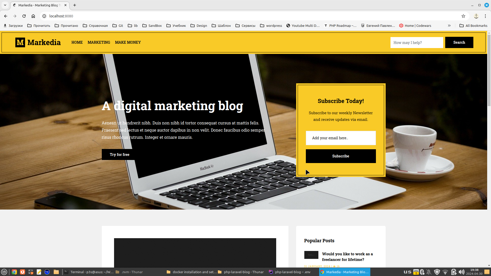

# ✍️ Laravel Blog 

A full-featured blog platform built with Laravel framework.  

**✨ Tech Stack**:  
- 🐘 PHP 8  
- 🚀 Laravel 10
- 🐬 MySQL (database)  
- 🔗 eloquent-sluggable (SEO-friendly URLs)  
- 🎨 Bootstrap + jQuery (frontend)  
- 👔 AdminLTE (admin dashboard)  

## 🌟 Features  
- 📝 Rich text article management  
- 🔍 SEO-optimized URLs  
- 👨‍💻 Modern admin dashboard  
- 📱 Responsive design  

## 👀 Preview  
  

## ⚙️ Installation  

1. **Clone repository**:  
```bash
git clone https://github.com/PavlenkoEvgeniy/php-laravel-blog.git
```  

2. **Install dependencies**:  
```bash
composer install
npm install
```  

3. **Configure environment**:  
```bash
cp .env.example .env
php artisan key:generate
```  

4. **Run migrations**:  
```bash
php artisan migrate --seed
```  

## 🏃 Running the Project  
Start development server:  
```bash
php artisan serve
```  

Compile frontend assets:  
```bash
npm run dev
```  

Access:  
- Frontend: `http://localhost:8000`  
- Admin: `http://localhost:8000/admin`  

## 📜 License  
MIT  
